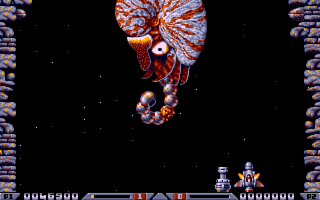

# Xenon2(-in-a-box)

Play MS-DOS Xenon2 on modern browsers or mobile screens [HERE](https://mad4j.github.io/xenon2-in-a-box/) or see the [MANUAL](manual.pdf).

Use the following commands

| Action | Key         | Gesture        |
|--------|-------------|----------------|
| Up     | Arrow Up    | -              |
| Down   | Arrow Down  | -              |
| Left   | Arrow Left  | -              |
| Right  | Arrow Right | -              |
| Fire   | Space       | -              |
| Drive  | Return      | -              |
